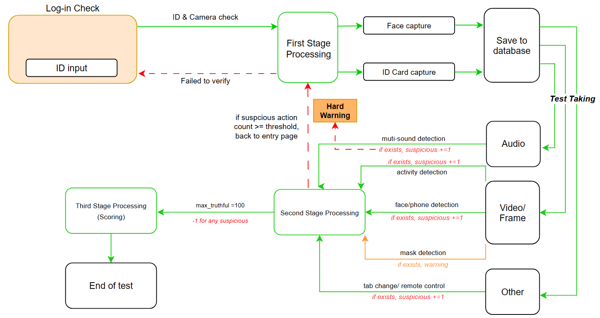
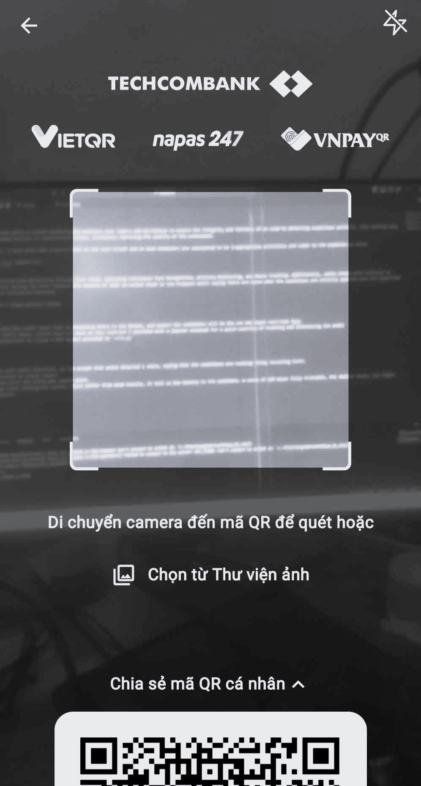

# Exam Proctoring Systems

## Task overview
Exam proctoring is the task where a system automatically monitors your camera and microphone to ensure the integrity and fairness of an exam by detecting suspicious activity, like looking away from the screen for extended periods or unauthorized noises, ultimately improving the quality of the assessment.

Based on the given topic, I have done some research both on the task itself and on what behaviors are considered to be inappropriate activities and comes to the pipeline as below
<p align="center">
 
</p>

Earlier approaches addressed exam monitoring through live video, employing Continuous Face Recognition, Activity Monitoring, and Mouse Tracking. Additionally, audio checks were utilized to identify suspicious voices during the test. However the records of what so-called cheat is too frequent which saying there are cases when the conditions are strictly applied into the algorithm and cause false positive situiation reported.

## Function propose
My solutions comes with 3 Stage-approach below:
### First Stage:
- IdCard Verification:
    - We dont want to make the model takes time on reasoning where is the bboxes, and expect the candidates will be the one who input real-time picture. The below is an example of how to make the candidates know where to focus on the streaming screen.
<p align="center">
 
</p>
-  We can use Yolo family model, action have not done on this task but i provided with a jupyter notebook for a quick overview of training and inferencing the model 
CRNN for text recognition on vision x NLP aspect provided in 

```sh 
python crnn.py 
```

   - Face capturing:
       - Same goes with the previous

### Second Stage
- Adjust the setting for audio detection, recoreded every 10 or 30s for space utilization; we can confirm that the audio detects one voice, indicating that the candidates are verbally reading or speaking aloud during the tests.
```sh
cd src/audio/
# audio tracker is the model to detect muti-people via audio
python recording.py 
```
- Face/Phone/Mask detection as visual aspect
```sh
cd src/screen/
# alert if non-person/ >=2 persons/ mask/phone detected
python object_detection.py 
```
- Behavior analysis:
    -   Eyes tracking: We use soft and hard trackers:
    ```sh
    cd src/screen/
    # soft tracking here, we based on maximum probability of 28 actions 
    # during the class and save records of the most frequent one.
    python action_detection.py

    # hard tracking, we based directly on the location of eye balls
    # to determine the direction that the eyes are looking.
    python eye_tracker.py
    ```
- Add-in remote desktop alert and using web search alert.
    ```sh
    cd src/system/

    # prevention from using another tab 
    python tab_tracker.py

    # prevention remote users via TeamViewer/Chrome Remote Desktop
    python remote_tracker.py
    ```
### Third Stage
- We can create a exam score (intergrity score), which differ from exam results, it tell us how honesty is the candidate, a score of 100 means fully trustable, the smaller grade, the higher level of untrustworthiness.
```python
## HAVE NOT COMPLETED YET
## Persudo code 
def truth_score(max_score, file_path_to_logs):
    '''
    logs file include:
    cheat_type, 
    message_type, 
    untrust_count (always 1)
    '''
    #either csv or txt
    logs = read_logs(file_path_to_logs) 

    # Initialize final score
    final_score = max_score
    
    # Process cheat logs
    for log in logs:
        cheat_type = log.cheat_type
        message_type = log.message_type
        
        # Deduct score based on cheat type and message type
        if message_type == "warning":
            final_score = final_score - (cheat_type * 0.5)
        else:
            final_score = final_score - 1
    
    # Return the final score
    return final_score
```
- I also provided hypothesis test, which is the post-processing after taking the test, final score/ any analysis for the test will be processed here
```sh
python hypothesis.py
```
## Demo Function
Provided [here](https://drive.google.com/file/d/1cVhZNMF4-3nIiwyeNBBIr35KVCYGTvi6/view?usp=sharing)

Any information, further requirements please contact me through thiendc3005@gmail.com
