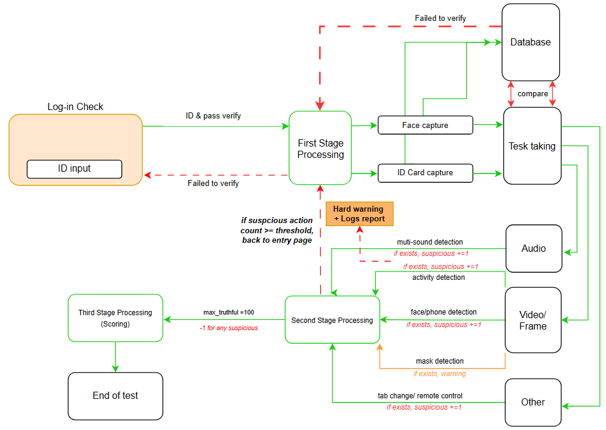

Examine
## ABOUT 
Exam proctoring is the task where a system automatically monitors your camera and microphone to ensure the integrity and fairness of an exam by detecting suspicious activity, like looking away from the screen for extended periods or unauthorized noises, ultimately improving the quality of the assessment.

Based on the given topic, I have done some research both on the task itself and on what behaviors are considered to be inappropriate activities and comes to the pipeline as below

 

Earlier approaches addressed exam monitoring through live video, employing Continuous Face Recognition, Activity Monitoring, and Mouse Tracking. Additionally, audio checks were utilized to identify suspicious voices during the test. However the records of what so-called cheat is too frequent which saying there are cases when the conditions are strictly applied into the algorithm and cause false positive situiation reported.

My solutions comes with approaches below:
- Adjust the condition with audio detection, we can accept that audio detected 1 voice, saying that the candidates are reading/ doing reasoning tests.
- Face/Phone/Mask detection as visual aspect
- Add-in remote desktop alert and using web search alert.
- We can create a exam score (intergrity score), which differ from exam results, it tell us how honesty is the candidate, a score of 100 means fully trustable, the smaller grade, the higher level of untrustworthiness.